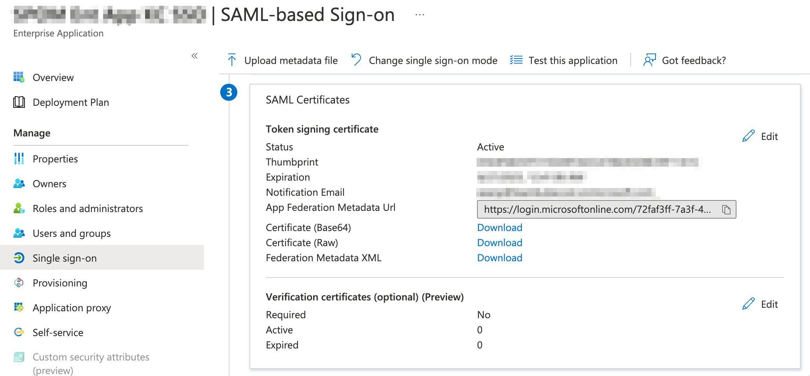

# Cloud Cost Explorer

The Cloud Cost Explorer is a dashboard which provides visualization and filtering of your cloud spending. This dashboard includes the costs for all assets in your connected cloud accounts by pulling from those providers' Cost and Usage Reports (CURs) or other cloud billing reports.



## Installation and configuration


As of v1.104, Cloud Cost is enabled by default. If you are using v1.04+, you can skip the Installation and Configuration section.


For versions of Kubecost up to v1.103, Cloud Cost needs to be enabled first through Helm, using [the following parameters](https://github.com/kubecost/cost-analyzer-helm-chart/blob/a9198777ecd6d1f68f38afb7e42d7cc13e17a1f8/cost-analyzer/values.yaml#L457-L463):

```yaml
kubecostModel:
  cloudCost:
     enabled: true
     labelList:
       IsIncludeList: false
       # format labels as comma separated string (ex. "label1,label2,label3")
       labels: ""
     topNItems: 1000
```

Enabling Cloud Cost is required. Optional parameters include:

* `labelList.labels`: Comma-separated list of labels; empty string indicates that the list is disabled
* `labelList.IsIncludeList`: If true, label list is a white list; if false, it is a black list
* `topNItems`: number of sampled "top items" to collect per day

While Cloud Cost is enabled, it is recommended to disable Cloud Usage, which is more memory-intensive.

```yaml
kubecostModel:
  etlCloudUsage: false
```


Disabling Cloud Usage will restrict functionality of your Assets dashboard. This is intentional. Learn more about Cloud Usage [here](https://docs.kubecost.com/install-and-configure/install/cloud-integration#cloud-usage).


### Using `topNitems`

Item-level data in the Cloud Cost Explorer is only a sample of the most expensive entries, determined by the Helm flag `topNitems`. This value can be increased substantially but can lead to higher memory consumption. If you receive a message in the UI "We don't have item-level data with the current filters applied" when attempting to filter, you may need to expand the value of `topNitems` (default is 1,000), or reconfigure your query.

## Configuring your query

### Date range

You can adjust your displayed metrics using the date range feature, represented by _Last 7 days_, the default range. This will control the time range of metrics that appear. Select the date range of the report by setting specific start and end dates, or by using one of the preset options.

### Aggregate filters

You can adjust your displayed metrics by aggregating your cost by category. Supported fields are _Workspace, Provider, Billing Account, Service Item_, as well as custom labels. The Cloud Cost Explorer dashboard supports single and multi-aggregation. See the table below for descriptions of each field.

|   Aggregation  | Description                                                                                                                                                |
| :------------: | ---------------------------------------------------------------------------------------------------------------------------------------------------------- |
|     Account    | The ID of the billing account your cloud provider bill comes from. (ex: AWS Management/Payer Account ID, GCP Billing Account ID, Azure Billing Account ID) |
|    Provider    | Cloud service provider (ex: AWS, Azure, GCP)                                                                                                               |
| Invoice Entity | Cloud provider account (ex: AWS Account, Azure Subscription, GCP Project)                                                                                  |
|     Service    | Cloud provider services (ex: S3, microsoft.compute, BigQuery)                                                                                              |
|      Item      | Individual items from your cloud billing report(s)                                                                                                         |
|     Labels     | Labels/tags on your cloud resources (ex: AWS tags, Azure tags, GCP labels)                                                                                 |

### Edit

Selecting the _Edit_ button will allow for additional filtering and pricing display options for your cloud data.

#### Add filters

You can filter displayed dashboard metrics by selecting _Edit_, then adding a filter. Filters can be created for the following categories to view costs exclusively for items (see descriptions of each category in the [Aggregate filters](https://docs.kubecost.com/using-kubecost/navigating-the-kubecost-ui/cloud-costs-explorer#aggregate-filters) table above):

* Service
* Account
* Invoice Entity
* Provider
* Labels

**Cost Metric**

The Cost Metric dropdown allows you to adjust the displayed cost data based on different calculations. Cost Metric values are based on and calculated following standard FinOps dimensions and metrics, but may be calculated differently depending on your CSP. Learn more about how these metrics are calculated by each CSP in the [Cloud Cost Metrics](https://docs.kubecost.com/apis/apis-overview/cloud-cost-api/cloud-cost-metrics) doc. The five available metrics supported by the Cloud Cost Explorer are:

| Cost Metric        | Description                                                                                 |
| ------------------ | ------------------------------------------------------------------------------------------- |
| Amortized Net Cost | Net Cost with removed cash upfront fees and amortized (default)                             |
| Net Cost           | Costs inclusive of discounts and credits. Will also include one-time and recurring charges. |
| List Cost          | CSP pricing without any discounts                                                           |
| Invoiced Cost      | Pricing based on usage during billing period                                                |
| Amortized Cost     | Effective/upfront cost across the billing period                                            |

## Cost table metrics

Your cloud cost spending will be displayed across your dashboard with several key metrics:

* K8 Utilization: Percent of cost which can be traced back to Kubernetes cluster
* Total cost: Total cloud spending
* Sum of Sample Data: Only when aggregating by _Item_. Only lists the top cost for the timeframe selected. Displays that may not match your CUR.

All line items, after aggregation, should be selectable, allowing you to drill down to further analyze your spending. For example, when aggregating cloud spend by _Service_, you can select an individual cloud service (AmazonEC2, for example) and view spending, K8 utilization, and other details unique to that item.
