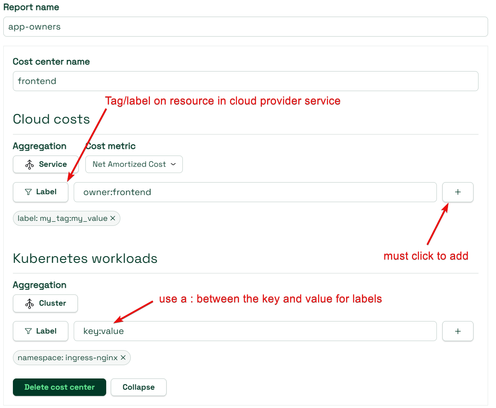

# Cost Center Report


Cost Center Report is a beta feature. Please share your feedback as we are in active development of this feature.


A Cost Center Report (CCR) allows you to join your Kubernetes resource costs with cloud-native services. For example, it allows combining S3 and/or BigQuery costs with the Kubernetes namespace that is consuming those services.

The reporting supports multiple types of resource matches in terms of labels/tags/accounts/K8s object names/etc.

## Adding a cost center

Begin by selecting _Reports_ in the left navigation. Then, select _Create a report > Advanced Report - Cost Centers_. The Cost Center Report page opens.

In the _Report name_ field, enter a custom value name for your report. This name will appear on your Reports page for quick access after creation.

In the _Cost center name_ field, enter the desired name for your Cost Center. Once a Report name and Cost center name have been provided, it should appear at the bottom of the page in the Report Preview. However, continue with this section to learn how to customize your Cost Center Report and complete its creation.

### Cloud costs

You can aggregate your cloud costs by a variety of fields (default is _Service_). Single and multi-aggregation, and custom labels, are supported. Then, select the desired cloud cost metric. Cloud cost metrics are calculated differently depending on your cloud service provider (CSP). Learn more about how different cloud cost metrics are calculated by CSP [here](https://docs.kubecost.com/apis/apis-overview/cloud-cost-api/cloud-cost-metrics).


Certain selected cloud cost metrics may produce errors forming your report preview. Use _Net Amortized Cost_, the default option, if you experience this error.


You can also provide custom filters to display only resources which match the filter value in your Cost Center Report. Select _Filter_ and choose a filter type from the dropdown, then provide your filter value in the text field. Select the plus sign icon to add your filter.

### Kubernetes workloads

Your Kubernetes workload data can be read as your Kubernetes allocations. You can aggregate and filter for your allocation data in the same way as your cloud cost data as described above. Default aggregation is _Namespace_.

Your cost center should automatically appear in the Report Preview. There is no need to finalize its creation; it will exist as long as all required fields have been provided. The Report Preview provides cost data for each cost center.

After configuring a cost center, you can select _Collapse_ to close that configuration (this is only to condense the page view, it will not affect your overall reported data).

### Tags and labels

Any cloud provider tag or label can be used, be sure to follow the [respective guide](cloud-integration.md) to ensure that they are included with the billing data.

when using tags and labels, separate the key and value with a `:`. Example: `owner:frontend`.

## Managing multiple cost centers

A single CCR allows for the creation of multiple cost centers within it. To create an additional cost center, select _Add cost center_. This will open a new cost center tab and the functionality of creating a cost center will be the same.

You can delete a cost center by selecting _Delete Cost Center_ in its tab, or selecting the trash can icon in the line of that cost center in the Report Preview.

## Finalizing a CCR

When you are finished adding or deleting cost centers, select _Done_ to finalize your CCR. You will be taken to a page for your reports. You can select individual cost centers for breakdowns of cloud costs and Kubernetes costs.


A cost center name is required in order for your cost center to appear in the Report Preview. However, if you select _Done_ without giving a name to a cost center, it will appear in your Report with a blank space for a name. It can still be interacted with, but it is recommended to name all cost centers.


The Cost column per line item is the total cost of all other columns.

You can also adjust the window of spend data by selecting the Time window box and choosing either a preset or entering a custom range.

When viewing a breakdown of your cloud costs, you may see the same aggregate repeated multiple times. These are of the same property across multiple different days. When you expand the window range, you should naturally see the number of line items increase.

If you return to the Reports page, you will now see your CCR displayed amongst your other reports. Selecting the three horizontal dots in the Actions column of your CCR will allow you to _Edit_ or _Delete_ the CCR.
